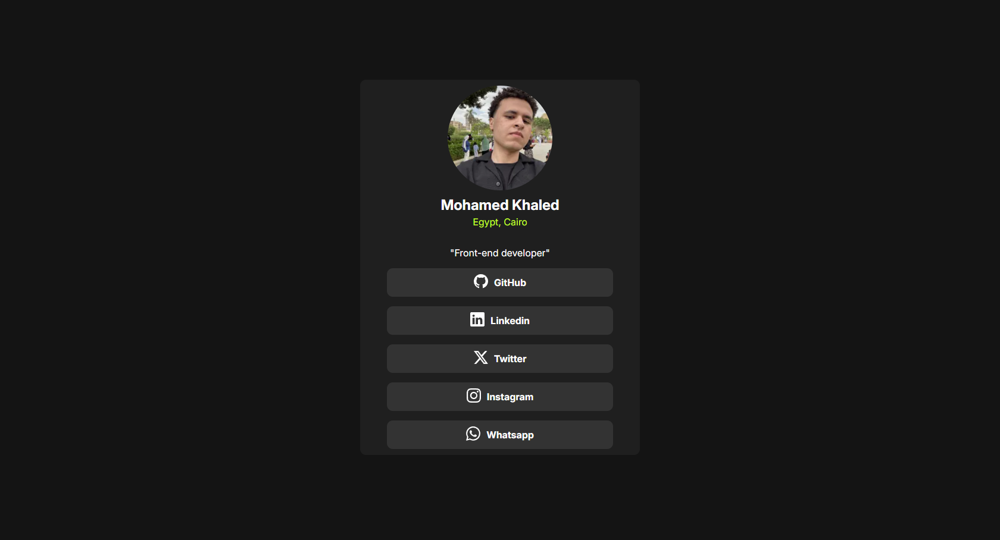
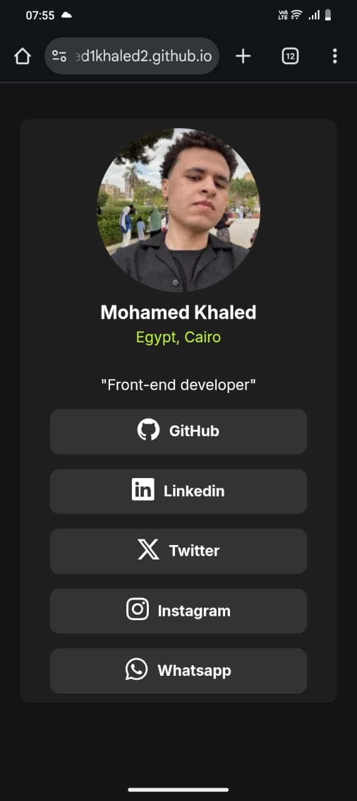

# Frontend Mentor - Social links profile solution

This is a solution to the [Social links profile challenge on Frontend Mentor](https://www.frontendmentor.io/challenges/social-links-profile-UG32l9m6dQ). Frontend Mentor challenges help you improve your coding skills by building realistic projects. 

## Table of contents

- [Overview](#overview)
  - [The challenge](#the-challenge)
  - [Screenshot](#screenshot)
  - [Links](#links)
- [My process](#my-process)
  - [Built with](#built-with)
  - [What I learned](#what-i-learned)
  - [Continued development](#continued-development)
- [Author](#author)


## Overview

### The challenge

Users should be able to:

- See hover and focus states for all interactive elements on the page

### Screenshot




### Links

- Solution URL: [Add solution URL here](https://github.com/Mohamed1khaled2/Social-links-profile)
- Live Site URL: [Add live site URL here](https://mohamed1khaled2.github.io/Social-links-profile/)

## My process

### Built with

- Semantic HTML5 markup
- CSS custom properties
- Flexbox
- Mobile-first workflow


### What I learned

Use this section to recap over some of your major learnings while working through this project. Writing these out and providing code samples of areas you want to highlight is a great way to reinforce your own knowledge.

To see how you can add code snippets, see below:

```html
  <a target="_blank" href="https://github.com/Mohamed1khaled2">
    <div class="icon-link">
      <svg xmlns="http://www.w3.org/2000/svg" width="24" height="24" fill="currentColor" class="bi bi-github2"
        viewBox="0 0 16 16">
        <path
          d="M8 0C3.58 0 0 3.58 0 8c0 3.54 2.29 6.53 5.47 7.59.4.07.55-.17.55-.38 0-.19-.01-.82-.01-1.49-2.01.37-2.53-.49-2.69-.94-.09-.23-.48-.94-.82-1.13-.28-.15-.68-.52-.01-.53.63-.01 1.08.58 1.23.82.72 1.21 1.87.87 2.33.66.07-.52.28-.87.51-1.07-1.78-.2-3.64-.89-3.64-3.95 0-.87.31-1.59.82-2.15-.08-.2-.36-1.02.08-2.12 0 0 .67-.21 2.2.82.64-.18 1.32-.27 2-.27s1.36.09 2 .27c1.53-1.04 2.2-.82 2.2-.82.44 1.1.16 1.92.08 2.12.51.56.82 1.27.82 2.15 0 3.07-1.87 3.75-3.65 3.95.29.25.54.73.54 1.48 0 1.07-.01 1.93-.01 2.2 0 .21.15.46.55.38A8.01 8.01 0 0 0 16 8c0-4.42-3.58-8-8-8" />
      </svg>
    </div>
    GitHub
</a>
```
```css
.button a  {
    text-decoration: none;
    color: hsl(0, 0%, 100%);
    margin-top: 1rem;
    background-color:  hsl(0, 0%, 20%);
    width: 80%;
    display: flex;
    align-items: center;
    justify-content: center;
    padding: 0.625em;
    border-radius: 0.625em;
    font-weight: bold;
    transition: background-color 0.25s, color 0.25s;
}


.button a:hover {
    background-color: hsl(75, 94%, 57%);
    color: black;
}

.icon-link  {
    margin-right: 0.625em;
}

@media (min-width: 320px) and (max-width: 720px) {

  main {
    width: 45%;
    max-width: 720px;
    min-width: 320px;
}

    .about-me .user-name {
        font-size: 1.25rem;
}

}
```

### Continued development

I'm currently focusing on improving my front-end development skills by building more real-world projects. I’m working on becoming more confident with:

Responsive web design

Advanced CSS techniques (Flexbox, Grid, animations)

JavaScript fundamentals

Working with design systems and UI libraries

I also plan to start learning popular JavaScript frameworks like React to build more dynamic and interactive user interfaces.


## Author

- Frontend Mentor - [@Mohamed1khaled2](https://www.frontendmentor.io/profile/@Mohamed1khaled2)
- X - [Mohamed Khaled](https://x.com/mada_555)